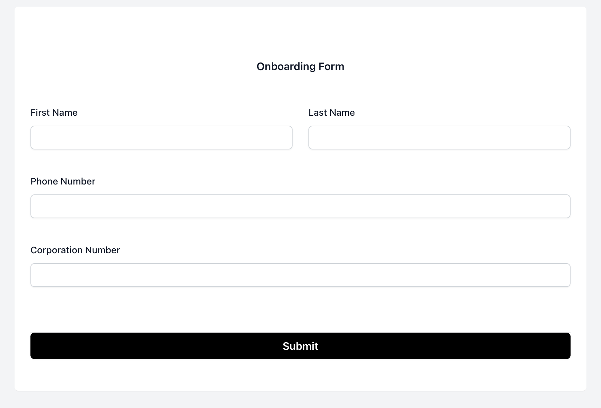
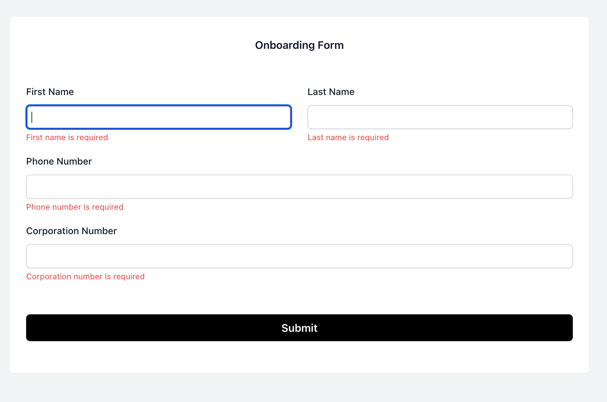
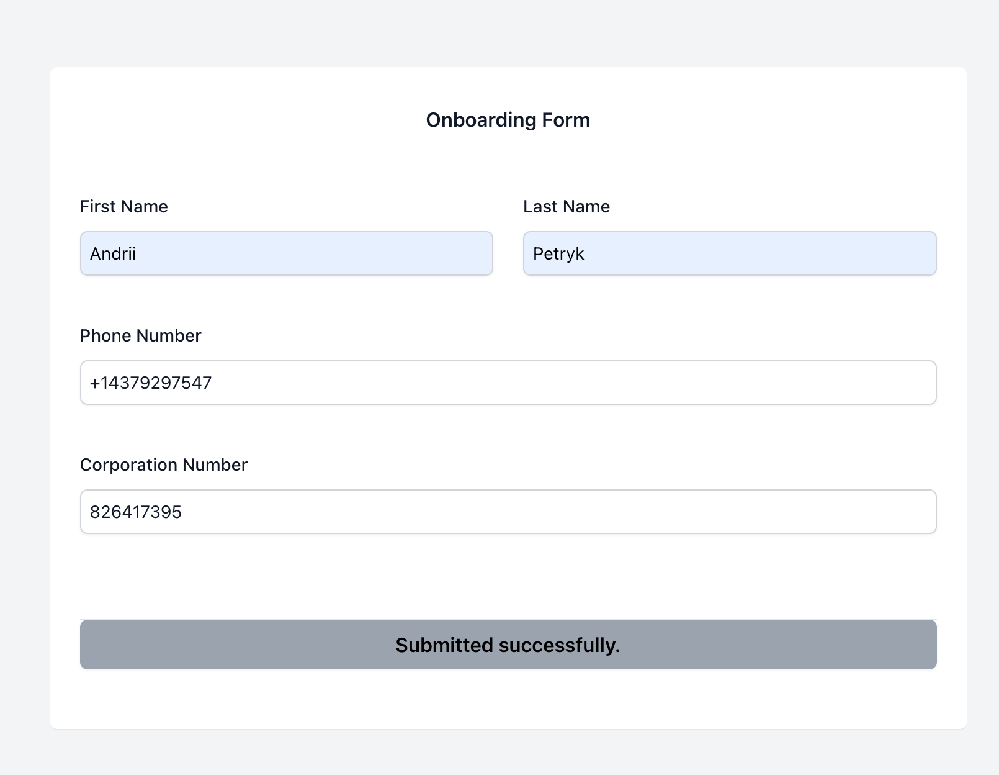

# Onboarding Form

> An interactive Onboarding Form built using React, TypeScript, and Tailwind CSS. It leverages react-hook-form for form handling, integrated with Yup for validation. The application is designed to collect user details and validate inputs such as corporation numbers through API calls.
> 
# General view of form


# View with errors highlighted



# View with success submitted



# Video with final version of the onboarding form
[OnboardingFormGenVersion.mp4](src/assets/OnboardingFormGenVersion.mp4)

## Live version on the form 

https://onboarding-form-test.netlify.app/

## Technologies Used

1. React: Frontend library for building the UI components.
2. TypeScript: Strongly typed JavaScript to enhance code quality and maintainability.
3. Tailwind CSS: Utility-first CSS framework for styling the components.
4. React Hook Form: Manages form state and validation efficiently.
5. Yup: Schema builder for form validation.
6. Axios: Used for making API requests.
7. Jest & React Testing Library: For unit and integration tests to ensure component reliability and form functionality.

## Features

1. Dynamic Form Handling: With real-time validation and error handling.
2. API Integration: Validates corporation numbers and submits profile details.
3. User-Friendly UI: Built with responsive design using Tailwind CSS.

## Tests

The project includes unit tests for components:

1. Component Tests: Tests for form components to check field rendering, validation errors, and form submission.


### Install Dependencies (frontend)

```
npm install
```

### Run

```
# Run frontend (:3000)
npm run start
```
